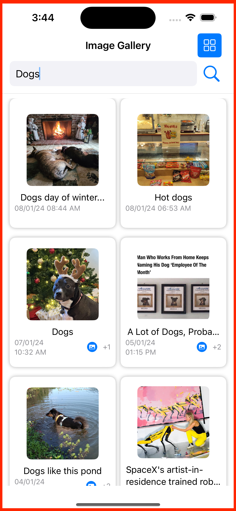
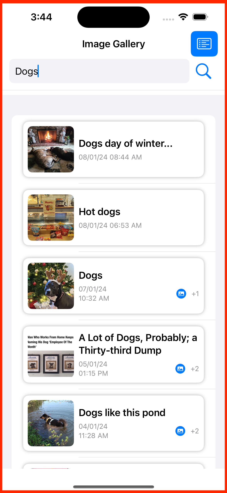
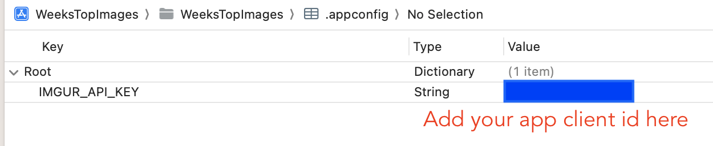

# Weeks Top Images on Imgur 📸
**WeeksTopImages**: Your go-to iOS app for discovering and exploring the week's top Imgur gallery images list.

## Features

- 🔍 Search for the top images of the week from the Imgur gallery.
- 📷 Display search results in a list or grid view.
- 🔄 Display search result in reverse chronological order
- 🖼️ View detailed information for each image, including title, date, and number of additional images if available.
- Toggle between list and grid views for a personalized experience.

## ScreenShots

<div align="center">
   
   
</div>


## Getting Started 🚀

Follow the steps below to set up and run the WeeksTopImages app locally.

### Prerequisites

- Xcode installed on your development machine.

### Installation

1. Clone the repository to your local machine.

   ```bash
      git clone https://github.com/pshivakumar/iOS-app-weeks-top-images
   ```
2. Open the Xcode project file (WeeksTopImages.xcodeproj) in Xcode.
3. Add .appconfig.plist:
   1. In the project navigator, locate the WeeksTopImages folder.
   2. Right-click on the folder and select New File....
   3. Choose the "Property List" template and name it **.appconfig.plist**
   4. Add the following in the **.appconfig.plist** file.

         <div align="center">
            
         </div>
   6. Your can register your app and get the client id from here https://api.imgur.com/oauth2/addclient
   5. Make sure the following line is included in .gitignore file, if not included already

   ```bash
      ## Ignore .config.plist since it stores sensitive info like api-keys
      .appconfig.plist
   ```
   6. Install Dependencies:
      1. If you're using Swift Package Manager, the dependencies should be resolved automatically. If not, resolve dependencies using the package manager.
   7. Build and run the app using Xcode.

### Usage
   -  Upon launching the app, use the search bar to enter a search text.
   -  Toggle between list and grid views using the provided switch.
   -  View detailed information for each image on the image cell.
      
### Testing

   Unit tests are included in the WeeksTopImagesTests folder. Use XCTest to run the tests and ensure the app's functionality.

## Dependencies

The project uses following external dependencies
   1. [**ViewInspector**](https://github.com/nalexn/ViewInspector) is a library for unit testing SwiftUI views.
   2. [**URLImage**](https://github.com/dmytro-anokhin/url-image) manages downloading remote image and caching it locally, both in memory and on disk, for you.

## Future Improvements

The following improvements needs to be taken up
   1. Improve the user experience
   2. Improve the unit test coverage to 90%
   3. Improve the UI test coverage
